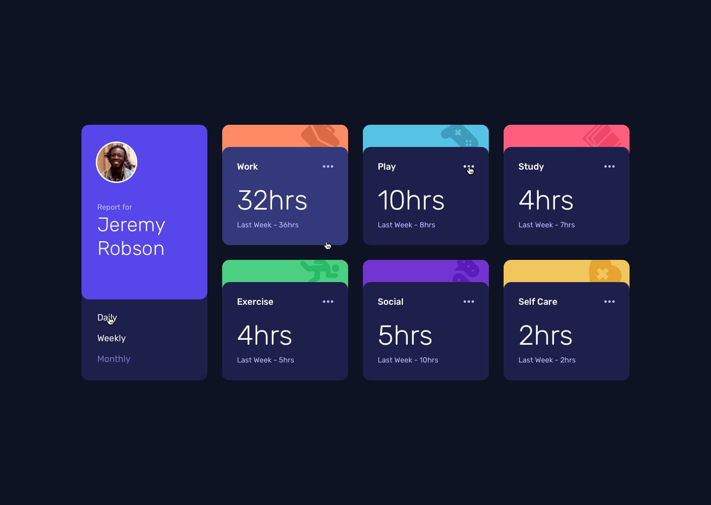
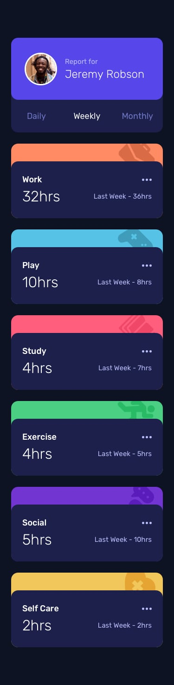

# Frontend Mentor - Time Tracking Dashboard Solution

This is my solution to the **Time Tracking Dashboard** challenge on Frontend Mentor. This project focuses on building a fully responsive dashboard that displays time tracking statistics across different periods using dynamic data loaded from a JSON file.

The challenge was a great opportunity to practice responsive layouts, asynchronous JavaScript, DOM manipulation, dynamic rendering, reusable functions, Tailwind CSS customization, and deploying a static application with Vite and GitHub Pages.

---

## Table of contents

* [Overview](#overview)
* [The challenge](#the-challenge)
* [Design](#design)
* [Links](#links)
* [My process](#my-process)
* [Built with](#built-with)
* [What I learned](#what-i-learned)

---

## Overview

This project is a responsive time tracking dashboard that allows users to switch between daily, weekly, and monthly activity reports.

The dashboard dynamically loads activity data from a JSON file and updates the UI based on the selected timeframe without reloading the page.

The layout adapts seamlessly across desktop, tablet, and mobile devices using a mobile-first approach and responsive utility classes provided by Tailwind CSS.

All activity cards are generated dynamically through JavaScript, reducing code duplication and improving maintainability.

---

## The challenge

Users should be able to:

* View the optimal layout depending on their device's screen size.
* Switch between daily, weekly, and monthly reports.
* See current and previous tracked hours for each activity.
* View hover and focus states for interactive elements.
* Experience responsive layouts across desktop, tablet, and mobile devices.
* Interact with dynamically rendered activity cards.
* View data loaded asynchronously from a JSON source.

---

## Design

### Desktop Design

### Active states

### Mobile Design

---

## Links

* Solution URL: [GitHub Repository](https://github.com/mlopezl/time-tracking-dashboard-challenge)
* Live Site URL: [Live Demo](https://mlopezl.github.io/time-tracking-dashboard-challenge/)

---

## My process

* Structured the layout using **semantic HTML5** elements such as `main`, `section`, `article`, and `header`.
* Followed a **mobile-first approach**, progressively enhancing the design with responsive breakpoints.
* Built responsive layouts using **Flexbox** and Tailwind CSS utility classes.
* Customized Tailwind CSS using theme variables for colors and typography.
* Created reusable utility classes for activity category backgrounds.
* Loaded dashboard data asynchronously using the Fetch API.
* Implemented asynchronous programming with:

  * `async`
  * `await`
  * `try...catch`
* Dynamically generated activity cards through DOM manipulation.
* Refactored repetitive code into a reusable `renderActivities()` function.
* Added event listeners to update the dashboard when users switch between timeframes.
* Managed application state using JavaScript variables and dynamic rendering.
* Organized static assets and JSON data for proper Vite build compatibility.
* Deployed the production build to GitHub Pages.

---

## Built with

* HTML5
* Tailwind CSS v4
* JavaScript (ES6+)
* Flexbox
* CSS Custom Properties (Variables)
* Responsive Design Principles
* Mobile-first Workflow
* DOM Manipulation
* Event Listeners
* Fetch API
* Async/Await
* JSON Data Handling
* Template Literals
* Dynamic Rendering
* Vite
* GitHub Pages

---

## What I learned

* Building responsive dashboard interfaces using semantic HTML5.
* Creating layouts efficiently with Tailwind CSS utility classes.
* Customizing Tailwind CSS through theme variables.
* Loading external JSON data using the Fetch API.
* Working with asynchronous JavaScript using `async` and `await`.
* Handling fetch errors using `try...catch`.
* Dynamically generating UI components with template literals.
* Manipulating the DOM efficiently using `innerHTML`.
* Refactoring repetitive code into reusable functions.
* Managing application state based on user interactions.
* Using event listeners to update the interface dynamically.
* Understanding how Vite handles static assets and build processes.
* Organizing project assets using the `public` directory.
* Deploying static frontend applications with GitHub Pages.
* Improving maintainability through reusable rendering functions and cleaner code structure.